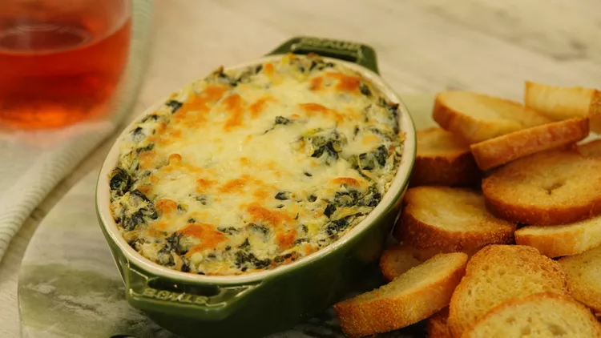

#  Artichoke Spinach Dip

**Prep** 15  
**Cook** 25  
**Makes** 4  
**Difficulty** Easy  
**Source:** <https://www.allrecipes.com/recipe/26819/hot-artichoke-and-spinach-dip-ii/>

### Ingredients
- 1 (8 ounce) package cream cheese, softened
- ¼ cup mayonnaise
- ¼ cup grated Parmesan cheese
- ¼ cup grated Romano cheese
- 1 clove garlic, peeled and minced
- ½ teaspoon dried basil
- ¼ teaspoon garlic salt
- salt and pepper to taste
- 1 (14 ounce) can artichoke hearts, drained and chopped
- ½ cup frozen chopped spinach, thawed and drained
- ¼ cup shredded mozzarella cheese

### Directions
- Preheat the oven to 350 degrees F (175 degrees C). Lightly grease a small baking dish.
- Mix cream cheese, mayonnaise, Parmesan cheese, Romano cheese, garlic, basil, garlic salt, salt, and pepper together in a medium bowl. Gently stir in artichoke hearts and spinach.
- Transfer the mixture to the prepared baking dish; top with mozzarella cheese. Bake in the preheated oven until bubbly and lightly browned, about 25 minutes.
