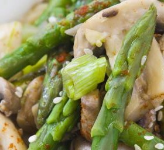

## INGREDIENTS
- 1/4 cup chicken broth or stock
- 2 1/2 tablespoons oyster sauce
- 1/2 teaspoon granulated sugar
- Black pepper, to taste
- 1 teaspoon cornstarch
- 2 teaspoons water
- 2 tablespoons peanut or vegetable oil for stir-frying
- 1 1/2 teaspoons minced fresh ginger
- 1 teaspoon finely chopped garlic
- 1/2 pound asparagus, washed, trimmed, cut diagonally into 1 1/2-inch strips
- 1/4 cup water
- 1 cup sliced mushrooms
- 1 medium red bell pepper, deseeded, cut into thin strips
- 1 teaspoon Chinese rice wine or dry sherry, or as needed
- 1/4 - 1/2 teaspoon Asian sesame oil (I used 1/2 teaspoon)

## DIRECTIONS
- In a small bowl or measuring cup, stir together the chicken broth or stock, oyster sauce, sugar and black pepper. In a separate small bowl, dissolve the cornstarch in the water.
- Heat wok and add oil, swirling so that it coats the bottom half of the pan. When the oil is hot, add the garlic and ginger. Stir for about 10 seconds until aromatic.
- Add the asparagus and stir-fry for 1 minute. Add the water, cover and let steam for 1 to 2 minutes, until the water is nearly absorbed.
- Push the asparagus to the sides of the wok. Add the mushrooms and bell pepper in the middle. Stir-fry for a minute, sprinkling a bit of rice wine or dry sherry over the mushrooms as you stir-fry. Push the mushrooms and bell pepper to the sides of the wok.
- Give the sauce a quick stir and pour into the middle of the wok. Stir the cornstarch and water mixture and pour it into the sauce, stirring quickly to thicken. Once the sauce thickens, stir to combine the vegetables in the thickened sauce. Stir in the sesame oil. Serve over cooked rice.
