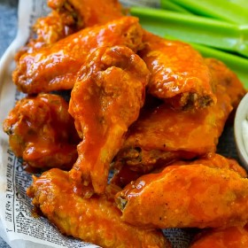

#  Baked Buffalo Wings

**Prep** 20 minutes  
**Cook** 45 minutes  
**Makes** Servings 6 servings  
**Source:** [Dinneratthezoo.com](https://www.dinneratthezoo.com/baked-buffalo-
wings/)

###  Ingredients

  *  **3** pounds party style chicken wings or whole chicken wings that have been halved crosswise
  *  **1** tablespoon baking powder do NOT use baking soda
  *  **1** teaspoon salt
  *  **1/2** teaspoon pepper
  *  **1/2** teaspoon garlic powder
  *  **1/2** teaspoon onion powder
  *  **1/2** cup hot sauce such as Frank's Red Hot Sauce
  *  **4** tablespoons butter melted
  *  **1** tablespoon honey
  * celery sticks and ranch dressing for serving.

###  Directions

Preheat the oven to 400 degrees. Line a sheet pan with foil and place a non
stick oven safe rack on top of the pan.

Place the chicken wings in a bowl. Add the baking powder, salt, pepper, garlic
powder and onion powder.

Toss to coat the chicken evenly with the baking powder and spices.

Place the wings on the rack in a single layer.

Bake for 45 minutes or until wings are light golden brown and crispy.

In a small bowl, whisk together the hot sauce, butter and honey.

Pour the sauce over the wings and toss to coat evenly.

Serve with celery sticks and ranch dressing.

###  Nutrition

Calories 464kcal

Calories: 464kcal | Carbohydrates: 2g | Protein: 36g | Fat: 24g | Saturated
Fat: 14g | Cholesterol: 215mg | Sodium: 522mg | Fiber: 1g | Sugar: 1g

