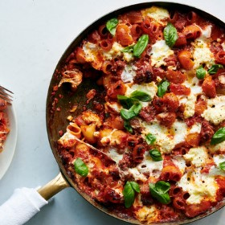

#  Baked Pasta with Sausage

**Prep** 15  
**Cook** 45  
**Makes** 4  
**Difficulty** Medium
**Source:** <https://cooking.nytimes.com/recipes/1020811-cheesy-baked-pasta-with-sausage-and-ricotta>

###  Ingredients

  *  **3** tablespoons extra-virgin olive oil
  *  **¾** pound bulk hot or mild Italian sausage (pork, chicken or turkey)
  *  **4** garlic cloves, thinly sliced
  *  **1** teaspoon dried oregano
  *  **½** teaspoon fennel seeds, coarsely crushed
  * Pinch of red-pepper flakes, plus more for serving (optional)
  *  **1** (28-ounce) can whole peeled tomatoes with their juices
  *  **1** (14-ounce) can crushed or strained tomatoes
  *  **2** bay leaves
  * Kosher salt
  *  **12** ounces dried pasta, such as small shells, farfalle or other shaped pasta
  *  **8** ounces fresh mozzarella, torn into bite-size pieces
  *  **6** ounces whole-milk ricotta (about 3/4 cup)
  *  **⅓** cup grated Parmesan
  *  **¼** cup basil leaves
  * Black pepper, for serving

###  Directions

PREPARATION

Heat oven to 425 degrees. Heat oil in a 12-inch ovenproof skillet over medium-
high. Crumble sausage into skillet, using a spoon to break it into small
pieces. Cook until starting to brown, stirring occasionally, 5 to 7 minutes.
Stir in garlic, oregano, fennel seeds and red-pepper flakes (if using), and
cook another 1 to 2 minutes.

Stir in whole tomatoes and their juice, using a spoon to break them up. Add
crushed tomatoes, bay leaves and 2 teaspoons salt, and bring to a simmer.
Simmer for 10 minutes to thicken slightly.

Stir in pasta and 1 cup water and return to a simmer. Continue to simmer for 2
minutes, stirring frequently to make sure pasta doesn’t stick to the bottom of
the pan. Remove from heat, pluck out the bay leaves, and fold in about a third
of the mozzarella.

Top pasta with remaining mozzarella and dollops of ricotta. Sprinkle with
Parmesan, then transfer to oven. Bake until pasta is tender when poked with a
fork, and cheese is bubbly and lightly golden, 18 to 22 minutes. (If you’d
like a more deeply browned topping, run the pan under the broiler for 1 or 2
minutes.) Remove from oven and let cool slightly before serving. Top with
basil, plenty of black pepper, and more red-pepper flakes, if you like.

