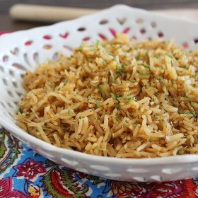

#  Beefy Onion Rice

Uncategorized

  
**Prep** 5 min  
**Cook** 25 min  
**Makes** 4
**Source:** [Mccormick.com](https://www.mccormick.com/recipes/salads-
sides/beefy-onion-rice)

###  Ingredients

  *  
**1** tablespoon oil
  *   
**1** cup long grain rice
  *   
**1** chopped fine onion
  *   
**1/2** teaspoon McCormick® Perfect Pinch® Italian Seasoning
  *   
**1** can (14 ounces) beef broth

###  Directions

Heat oil in medium saucepan on medium heat. Add rice and onion; cook and stir
until rice begins to BROWN.

Stir in broth and Italian seasoning; bring to boil. Reduce heat to low; cover
and simmer 30 minutes or until rice is tender.

###  Nutrition

Calories: 224 calories

