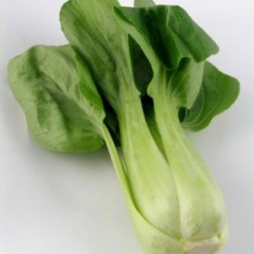



#  Bok Choy

Uncategorized

 **Source**[Mindfood.com](http://www.mindfood.com/recipe/bok-choy-asian-
greens-autumn-recipes/)

###  Ingredients

  * SHRIMP WITH CHINESE GREENS STIR FRY
  *  **1/2** – 3/4 pound shrimp
  *  **1** tablespoon Chinese rice wine or dry sherry
  *  **1/2** teaspoon salt
  *  **1** tablespoon cornstarch
  *  **1/2** pound Chinese greens (bok choy)
  *  **4** ounces fresh mushrooms, or 6 Chinese dried mushrooms or dried Shiitake mushrooms
  *  **2** tablespoons vegetable or peanut oil for stir-frying, or as needed
  *  **2** thin slices ginger
  *  **1/4** teaspoon salt
  *  **1/4** cup chicken broth, sodium-reduced if possible
  *  **1/2** teaspoon sugar
  *  **1** tablespoon light soy sauce
  * black pepper, to taste
  *  **1** teaspoon cornstarch mixed with 2 teaspoons water

###  Directions

If using frozen shrimp, defrost in the refrigerator. Rinse the shrimp under
cold running water and pat dry with paper towels. Place the shrimp in a bowl
and add the rice wine or sherry, 1/2 teaspoon salt and cornstarch, stirring in
one direction (this is to make sure the marinade spreads evenly.)

Chop the bok choy stalks diagonally and the leaves across into 1 inch pieces.
Wipe the mushrooms with a cloth or soft brush and cut into thin slices. If
using Chinese dried mushrooms, soak in hot water for 20 minutes to soften.
Drain the softened mushrooms, remove the stems and cut into quarters.

Preheat the wok and add 2 tablespoons oil. When the oil is hot, add the
ginger. Stir-fry for about 30 seconds, until aromatic, then add the prawns.
Stir-fry until they turn pink. Remove the cooked shrimp from the pan.

Add a bit more oil if needed so that there is about 1 1/2 tablespoons oil in
the wok. Add the bok choy, mushrooms and 1/4 teaspoon salt. Stir-fry for 1
minute (Note: add a small amount of water or rice wine if the vegetables are a
bit dry). Add the chicken broth, cover and cook for 2 more minutes.

Add the shrimp back into the pan. Add the sugar, soy sauce, and pepper. Give
the cornstarch/water mixture a quick restir and add in the middle, stirring to
thicken. Cook, stirring for another minute and serve hot.

