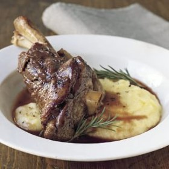



#  Braised Lamb Shanks with Rosemary

Uncategorized

 **Prep** 20 minutes **Cook** 140 minutes **Makes** Servings: 4
**Source**[Williams-sonoma.com](http://www.williams-sonoma.com/recipe/braised-
lamb-shanks-with-rosemary.html)

###  Ingredients

  * **4** lamb shanks, external fat trimmed
  * Salt and freshly ground pepper, to taste
  *  **2** Tbs. olive oil
  *  **2** yellow onions, diced
  *  **2** celery stalks, diced
  *  **2** carrots, diced
  *  **2** cups full-bodied red wine
  *  **1** cup beef stock
  *  **1** Tbs. dried rosemary
  *  **3** garlic cloves, crushed with the side
  * of a knife
  *  **1** bay leaf

###  Directions

Preheat an oven to 350ºF.

Season the lamb shanks with salt and pepper. In a large, deep sauté pan over
medium-high heat, warm the olive oil until nearly smoking. Working in batches
if needed, brown the shanks on all sides, about 5 minutes total. Transfer to a
platter.

Add the onions, celery and carrots to the pan and cook, stirring occasionally,
until the vegetables are golden and translucent, 3 to 5 minutes. Remove the
pan from the heat, add the wine and return the pan to medium-high heat. Bring
to a simmer, stirring to scrape up any browned bits from the pan bottom. Add
the stock, rosemary, garlic, bay leaf and shanks and bring to a boil. Cover
the pan, transfer to the oven and cook until the meat is almost falling off
the bone, about 2 hours. Using tongs, transfer the shanks to a large serving
bowl.

Remove the bay leaf from the cooking liquid. Using a blender or a stick
blender, puree the liquid and solids until smooth. Season the sauce with salt
and pepper. Pour some of the sauce over the shanks and pass the rest
alongside.

