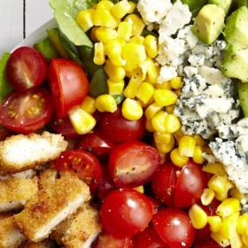



#  Breaded Chicken Cobb Salad

Uncategorized

  
**Prep** 0:15  
**Cook** 0:35  
**Makes** Serves: 4  
**Difficulty** Easy
**Source:** [Delish.com](http://www.delish.com/cooking/recipe-
ideas/recipes/a46115/breaded-chicken-cobb-salad-recipe/)

###  Ingredients

  *  
**1** lb. frozen breaded chicken breasts or cutlets
  *   
**1** large head romaine
  *   
**2** c. cherry tomatoes, halved
  *   
**1** c. corn kernels (canned or frozen)
  *   
**1/2** c. crumbled blue cheese
  *   
**1** avocado, diced
  *   
**1/2** lb. bacon, cooked and chopped
  * kosher salt
  * Freshly ground black pepper
  * Ranch dressing, for drizzling

###  Directions

Preheat oven to 350°. Bake chicken according to package directions; let cool
slightly, then slice.

Meanwhile, assemble salad: Arrange romaine on a serving platter and top with
chicken, tomatoes, corn, blue cheese, avocados, and bacon.

Season with salt and pepper and drizzle with ranch.

