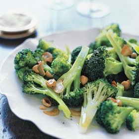



#  Broccoli with Toasted Garlic and Hazelnuts

Uncategorized

  
**Prep** 10 min  
**Cook** 15 min  
**Makes** Serves 8
**Source:** [Realsimple.com](http://www.realsimple.com/food-recipes/browse-all-
recipes/broccoli-toasted-garlic-hazelnuts)

###  Ingredients

  *  
**1/2** cup hazelnuts
  *   
**2** bunches broccoli (about 3 pounds), cut into long florets
  *   
**1/2** cup extra-virgin olive oil
  *   
**6** cloves garlic, sliced
  *   
**2** tablespoons fresh lemon juice
  * kosher salt and pepper

###  Directions

Heat oven to 375° F. Spread the hazelnuts on a rimmed baking sheet and toast,
tossing occasionally, until fragrant, 5 to 6 minutes; roughly chop.

Meanwhile, fill a large saucepan with 1 inch of water and fit with a steamer
basket (or fill a large pot with 1/2 inch of water). Bring to a simmer. Place
the broccoli in the steamer basket, cover, and steam until tender, 4 to 5
minutes. Transfer to a platter.

Meanwhile in a small saucepan, cook the oil and garlic over low heat until the
garlic is just golden, 4 to 6 minutes. Transfer to a small bowl and stir in
the hazelnuts, lemon juice, and 1/2 teaspoon each salt and pepper. Drizzle
over the broccoli.

###  Nutrition

229 calories

Total Carbohydrates: 13 g

Cholesterol: 0 mg

Total Fat: 19 g

Dietary fiber: 5 g

Protein: 6 g

Saturated fat: 2 g

Per Serving

Sodium: 171 mg

Sugar: 3 g

