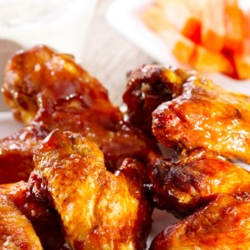

#  Buffalo Chicken Wings

**Prep** 20 minutes  
**Cook** 1 hour 10 minutes  
**Makes** About 60  
**Source:** [Epicurious.com](https://www.epicurious.com/recipes/food/views/crispy-baked-chicken-wings-388693)

###  Ingredients

  *  **Buffalo sauce:**
  *  **1** tablespoon unsalted butter, melted
  *  **1/4** teaspoon cayenne pepper
  *  **1/4** teaspoon freshly ground black pepper
  *  **1/4** teaspoon kosher salt
  *  **1/4** cup hot pepper sauce (such as Frank's)
  *  **Ginger-soy glaze:**
  *  **1/4** cup honey
  *  **2** tablespoons soy sauce
  *  **3** large garlic cloves, crushed
  *  **1 2** x1" piece of ginger, peeled, sliced
  *  **Wings: 5** pounds chicken wings, tips removed, drumettes and flats separated
  *   **2** tablespoons vegetable oil
  *   **1** tablespoon kosher salt
  *   **1/2** teaspoon freshly ground black pepper

###  Directions

For buffalo sauce:

Mix first 4 ingredients in a medium bowl; let stand for 5 minutes. Whisk in
hot sauce; keep warm.

DO AHEAD: Can be made 1 week ahead. Let cool completely; cover and chill.
Rewarm before using.

For ginger-soy glaze:

Bring all ingredients and 1/4 cup water to a boil in a small saucepan,
stirring to dissolve honey. Reduce heat to low; simmer, stirring occasionally,
until reduced to 1/4 cup, 7–8 minutes. Strain into a medium bowl. Let sit for
15 minutes to thicken slightly.

DO AHEAD: Can be made 5 days ahead. Cover; chill. Rewarm before using.

For wings:

Preheat oven to 400°F. Set a wire rack inside each of 2 large rimmed baking
sheets. Place all ingredients in a large bowl; toss to coat. Divide wings
between prepared racks and spread out in a single layer.

Bake wings until cooked through and skin is crispy, 45–50 minutes.

Line another rimmed baking sheet with foil; top with a wire rack. Add half of
wings to ginger-soy glaze and toss to evenly coat. Place wings in a single
layer on prepared rack and bake until glaze is glossy and lightly caramelized,
8–10 minutes.

Toss remaining half of wings in Buffalo sauce. Serve immediately (no need to
bake).

###  Nutrition

Calories 83

Carbohydrates 1 g(0%)

Fat 6 g(9%)

Protein 7 g(13%)

Saturated Fat 2 g(8%)

Sodium 97 mg(4%)

Polyunsaturated Fat 1 g

Fiber 0 g(0%)

Monounsaturated Fat 3 g

Cholesterol 42 mg(14%)

per serving (60 servings)

