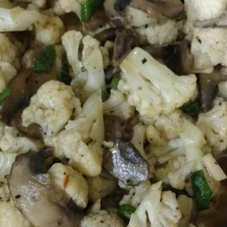



#  Cauliflower Supreme

Uncategorized

  
**Prep** 15 m  
**Cook** 30 m  
**Makes** 6
**Source:** [Allrecipes.com](http://allrecipes.com/recipe/43725/cauliflower-
supreme/)

###  Ingredients

  *  
**1** head cauliflower, broken into small florets
  *   
**1/2** cup butter
  *   
**1/2** pound fresh mushrooms, sliced
  *   
**1/2** cup green onions, sliced
  *   
**1/3** cup blanched slivered almonds
  *   
**2** teaspoons chicken bouillon
  *   
**1 1/2** tablespoons cornstarch
  *   
**1** cup water

###  Directions

Heat one inch of water to a boil in a saucepan over medium-high heat. Add
cauliflower florets, and cook covered for 7 to 9 minutes, or until tender.
Drain and set aside.

Melt the butter in a large skillet over medium heat. Saute mushrooms, onion,
and almonds. Stir in the chicken bouillon. Dissolve the cornstarch in water,
and gradually stir into the mushroom mixture. Cook until thickened. Pour the
mushroom mixture over the hot cauliflower, and serve.

###  Nutrition

Calories: 215 kcal

Total Carbohydrates: 10g

Cholesterol: 41 mg

Total Fat: 18.6 g

Protein: 4.7 g

Sodium: 153 mg

