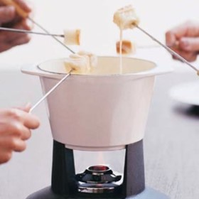



#  Cheese Fondue

Uncategorized

  
**Prep** 30 min  
**Cook** 30 min  
**Makes** 6 servings
**Source:** [Epicurious.com](http://www.epicurious.com/recipes/food/views/cheese-
fondue-231492)

###  Ingredients

  *  
**1** garlic clove, halved crosswise
  *   
**1 1/2** cups dry white wine
  *   
**1** tablespoon cornstarch
  *   
**2** teaspoons kirsch (optional)
  *   
**1/2** pound Emmental cheese, coarsely grated (2 cups)
  *   
**1/2** pound Gruyère, coarsely grated (2 cups)
  *   
**What to dip:**
  * Cubes of French bread
  * Cubes of apple and pear
  * Roasted potatoes
  * Julienned raw red bell pepper
  * Blanched broccoli florets
  *   
**What to drink:**
  * Dry white wine such as dry Riesling or Sancerre
  * German lager or Saison-style ale
  * Farmhouse cider
  * Fino Sherry

###  Directions

Rub inside of a 4-quart heavy pot with cut sides of garlic, then discard
garlic. Add wine to pot and bring just to a simmer over moderate heat.

Stir together cornstarch and kirsch (if using; otherwise, use water or wine)
in a cup.

Gradually add cheese to pot and cook, stirring constantly in a zigzag pattern
(not a circular motion) to prevent cheese from balling up, until cheese is
just melted and creamy (do not let boil). Stir cornstarch mixture again and
stir into fondue. Bring fondue to a simmer and cook, stirring, until
thickened, 5 to 8 minutes. Transfer to fondue pot set over a flame.

###  Nutrition

Calories 345

Carbohydrates 3 g(1%)

Fat 25 g(38%)

Protein 20 g(41%)

Saturated Fat 14 g(72%)

Sodium 515 mg(21%)

Polyunsaturated Fat 1 g

Fiber 0 g(0%)

Monounsaturated Fat 7 g

Cholesterol 80 mg(27%)

per serving (6 servings)

