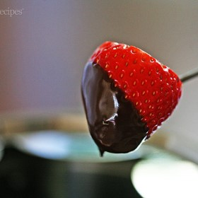



#  Chocolate Fondue

Uncategorized

  
**Prep** 5 minutes  
**Cook** 10 minutes  
**Makes** Serves 8
**Source:** [Simplyrecipes.com](http://www.simplyrecipes.com/recipes/chocolate_fondue/)

###  Ingredients

  *  
**12** ounces of milk or dark chocolate (chips or roughly chopped if from a block)
  *   
**1** cup (8 ounces) of heavy whipping cream
  * A pinch of salt
  * Dip-ables such as strawberries, banana pieces cut into 1-inch chunks, dried appricots, candied ginger, apple pieces

###  Directions

1 Heat the cream over medium heat in a small saucepan until tiny bubbles show
and begins to lightly and slowly simmer.

2 Remove from heat, add the chocolate, and whisk until smooth and full
incorporated.

3 Immediately transfer to a fondue pot heated at low or with a low flame, or
serve straight from the pot.

Arrange the dip-ables on a platter or plates around the chocolate pot. Use a
fondue fork, bamboo skewer, seafood fork, or salad fork to dip the fruit
pieces and other dippables into the hot melted cream chocolate mixture. Eat
immediately.

If the fondue begins to feel a little stiff, add a tablespoon of heavy cream
and stir. It will help it go a little longer. Eventually, it will cook down
though and you may need to start a new pot.

Variations

Add a tablespoon or two of Bailey's Irish Cream to the chocolate. Other
liquors such as Grand Marnier, Amaretto, or Kirsch are equally yummy.

Add a 1/2 teaspoon of cinnamon and ancho chili pepper for a nice Mexican
Chocolate.

The contents of a vanilla pod or some vanilla extract are always a decadent
touch to chocolate.

A good pinch of espresso powder can do wonders!

Orange zest or grapefruit zest is nice way to create a slightly fruity
chocolate.

A few tablespoons of Torani flavoring syrups (the kind used for coffee or
Italian sodas) can add a nice dimension of flavor as well.

Add a teaspoon of peppermint extract for peppermint chocolate fondue.

White chocolate is always a nice change, and spiked with a little liquor or
citrus zest becomes heavenly.

Steeping the cream for an hour beforehand and while heating it can add a nice
subtle flavor, lemongrass for white chocolate or a bag of Earl Grey tea for
dark chocolate are particularly stylish and contemporary.

