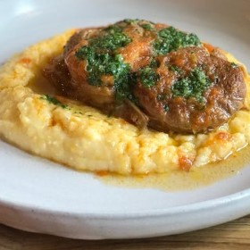



#  Classic Italian Veal Osso Buco

Uncategorized

 **Prep** 15 minutes **Cook** 4 hours ad 45 minutes **Makes** Yield: 6
servings
**Source**[Tastingtable.com](https://www.tastingtable.com/cook/recipes/osso-
bucco-veal-italian-recipe)

###  Ingredients

  * **3** pounds veal osso bucco center cuts (6 pieces)
  * Salt and pepper, to taste
  *  **¼** cup all-purpose flour
  * Olive oil, as needed
  *  **1** sprig fresh rosemary
  *  **1** sprig fresh thyme
  *  **1** bay leaf
  *  **½** cup extra virgin olive oil
  *  **1** large white onion, chopped
  *  **3** celery stalks, chopped
  *  **3** large carrots, chopped
  *  **1** tablespoon tomato paste
  *  **1** cup red wine
  *  **3** cups vegetable stock
  *  **1** pound polenta
  *  **1** bunch spring onions
  *  **1** bunch basil
  *  **2** lemons, zested
  *  **1** cup grated fontina
  *  **2** tablespoons butter
  * Pinch of sugar

###  Directions

1\. Pat the veal dry, making sure it's at room temperature. Season well with
salt and pepper. Coat the veal in flour and shake off excess.

2\. Heat the olive oil in a large pot over medium-high heat. Cook the veal in
batches, until browned all over, 3 minutes each side. Remove from the pot and
set aside to rest.

3\. Place the rosemary, thyme, bay leaf and cloves into cheesecloth and secure
with twine. This will be your bouquet garni.

4\. Add the extra virgin olive oil without cleaning the pot. Cook the whole
onion at medium heat until translucent, 5 minutes, scraping up the remaining
pieces of meat. Add the celery and carrot and stir until vegetables soften.
Increase the heat and add the tomato paste.

5\. Place the veal back in the pot. Add the wine and let it cook for 2
minutes. Add bouquet garni and the vegetable stock, ensuring the veal is
immersed in the liquid. Bring to a boil then cover and simmer for 4 hours,
until the veal is soft and you can break it with a fork.

6\. Open the pot, flip the veal and cook for 15 minutes.

7\. Meanwhile, bring 5 cups of water, to a boil. Add salt and pepper, and cook
the polenta until dense, 40 minutes. Set aside.

8\. Chop the spring onion, basil, and lemon zest and combine to make gremolata
for topping the osso buco.

9\. Before serving the polenta, add the fontina, the butter and sugar. Serve
osso buco over polenta, adding some of the juice from the cooking and top it
with gremolata.

