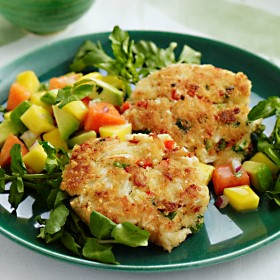



#  Crab Cakes with Tropical Salad

Uncategorized

 **Prep** 0:15 **Cook** 0:10 **Makes** Serves: 4 **Difficulty** Easy
**Source**[Delish.com](http://www.delish.com/cooking/recipe-
ideas/recipes/a30912/crab-cakes-tropical-salad-recipe-rbk0610/)

###  Ingredients

  * **CRAB CAKES:**
  *  **½** c. light mayonnaise
  *  **1** large egg
  *  **1½** tsp. curry powder
  *  **1½** tsp. Worcestershire sauce
  *  **1½** tsp. Grainy mustard
  *  **½** tsp. kosher salt
  *  **1** tsp. Freshly ground black pepper
  *  **⅓** c. finely diced red bell pepper
  *  **¼** c. snipped fresh chives or chopped scallions
  *  **1** lb. lump crabeat
  *  **1¼** c. panko (Japanese breadcrumbs)
  *  **TROPICAL SALAD:**
  *  **1** ripe mango
  *  **1** ripe red-fleshed papaya
  *  **1** ripe Haas avocado
  *  **2** tbsp. minced red onion
  *  **2** tbsp. Chopped cilantro
  *  **2** tbsp. lime juice
  *  **1** tsp. kosher salt
  *  **1** bunch watercress bunch watercress
  *  **3** tbsp. canola oil

###  Directions

Crab Cakes: Whisk mayonnaise, egg, curry powder, Worcestershire sauce,
mustard, salt, and pepper until blended. Gently stir in bell pepper, chives,
and crabmeat; sprinkle 1/2 cup of the panko over the mixture and fold in. Put
remaining panko on a plate. Place rounded 1/3 cup of the crab mixture in a
loose mound in crumbs; pat just enough crumbs over the top to hold the mixture
together and shape into a 3-inch cake. Place on waxed paper. Shape 7 more
cakes. Refrigerate while preparing salad.

Tropical salad: Pit and peel mango, cut into chunks, and place in a medium
bowl. Halve, seed, and peel papaya; cut into chunks and add to bowl. Pit and
peel avocado, cut into chunks, and add to bowl with onion, cilantro, lime
juice, salt, and watercress; do not toss yet.

In a large nonstick skillet, heat 1 1/2 tablespoons of the oil over medium
heat. Add 4 cakes; fry 5 minutes, turning once, until golden and crisp. Drain
on paper towels. Add remaining oil to skillet; fry remaining 4 cakes. Toss
salad; divide over 4 plates and serve each with 2 crab cakes.

