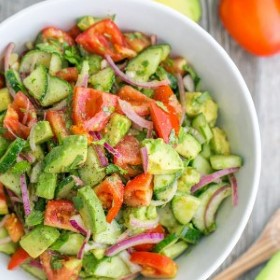



#  Cucumber Tomato Avocado Salad

Uncategorized

 **Prep** 15 mins **Cook** 15 mins **Makes** Serving: 4 **Difficulty** Easy
**Source**[Natashaskitchen.com](http://natashaskitchen.com/2015/06/01/cucumber-
tomato-avocado-salad/)

###  Ingredients

  * **1** lb Roma tomatoes
  *  **1** English cucumber
  *  **½** medium red onion, sliced
  *  **2** avocados, diced
  *  **2** Tbsp extra virgin olive oil or sunflower oil
  * Juice of 1 medium lemon (about 2 Tbsp)
  *  **¼** cup (1/2 bunch) cilantro, chopped
  *  **1** tsp sea salt or ¾ tsp table salt
  *  **⅛** tsp black pepper

###  Directions

Place chopped tomatoes, sliced cucumber, sliced red onion, diced avocado, and
chopped cilantro into a large salad bowl.

Drizzle with 2 Tbsp olive oil and 2 Tbsp lemon juice. Toss gently to combine.
Just before serving, toss with 1 tsp sea salt and ⅛ tsp black pepper.

