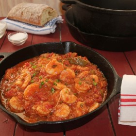



#  Emeril's Creole (halved original) Shrimp/Chicken

Uncategorized

 **Prep** 20 minutes **Cook** 1 hour **Makes** Yield: 3 servings
**Source**[Emerils.com](https://www.emerils.com/127949/emerils-shrimp-creole)

###  Ingredients

  * **2** ounces (1/2 stick) unsalted butter
  *  **1** cups chopped onions
  *  **1/2** cup chopped green bell pepper
  *  **1/2** cup chopped celery
  *  **1/2** teaspoon salt
  *  **1/4** teaspoon cayenne pepper
  *  **1** bay leaves
  * one-half 14.5-ounce can diced tomatoes
  *  **1** teaspoon chopped garlic
  *  **1/2** teaspoon Worcestershire Sauce
  *  **1/2** teaspoon hot sauce,or to taste
  *  **1** tablespoons all-purpose flour
  *  **1/2** cup water
  *  **1/2** cup shrimp stock
  *  **1** pounds peeled and deveined large shrimp
  *  **1** teaspoon Emeril's Essence Creole Seasoning
  *  **1/4** cup chopped green onions
  *  **1** tablespoons chopped parsley
  *  **4** cups cooked long-grain white rice

###  Directions

NOTE: if chicken: cube, brown in pan, set aside

In a large sauce pan, over medium heat, melt the butter. Add the onions,
peppers, and celery to the pan. Season the vegetables with salt and cayenne.
Saute the vegetables until they are wilted, about 6 to 8 minutes. Stir in the
bay leaves, tomatoes, and garlic. Bring the mixture to a boil and reduce to a
simmer; continue to cook for 15 minutes.

In a small bowl whisk the flour and water together and add the mixture to the
tomatoes. Cook for 4 to 5 minutes. Add the shrimp stock, Worcestershire and
hot sauce and continue to cook for 10 minutes longer. Season the shrimp with
Essence and add them to the pot. Cook the shrimp until they are pink and
cooked through,about 6 to 7 minutes. Stir in the green onions and parsley.

Serve with white rice.

