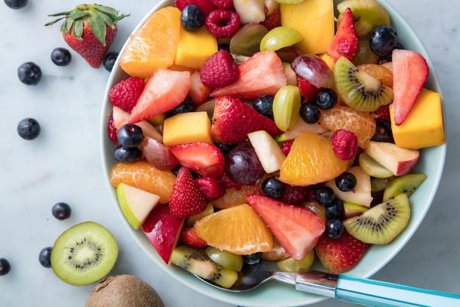

#  Fruit Salad

**Prep** 15 min  
**Cook** 0 min  
**Makes** Serves 8  
**Source:** [delish.com](https://www.delish.com/cooking/recipe-ideas/a19609963/easy-fruit-salad-recipe/)

###  Ingredients

#### FOR THE DRESSING  
1/4 c. honey  
1/4 c. freshly squeezed orange juice  
Zest of 1 lemon  
#### FOR THE SALAD  
1 lb. strawberries, hulled and quartered  
6 oz. blueberries  
6 oz. raspberries  
3 kiwis, peeled and sliced  
1 orange, peeled and wedges cut in half  
2 apples, peeled and chopped  
1 mango, peeled and chopped  
2 c. grapes  

###  Directions

In a small bowl whisk together honey, orange juice, and lemon zest. Add fruit to a large bowl and pour over dressing, tossing gently to combine. Chill until ready to serve.  

###  Nutrition

