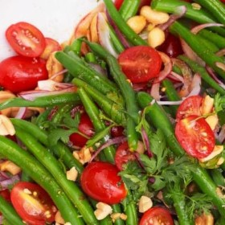

#  Green Bean Salad

**Prep** 0:20  
**Cook** 0:30  
**Makes** Serves: 8  
**Difficulty** Easy  
**Source:** [Womansday.com](http://www.womansday.com/food-recipes/food-drinks/recipes/a50976/green-bean-salad/)

###  Ingredients

  *  **2** lb. green beans, trimmed
  * kosher salt
  *   **1/2** red onion, thinly sliced
  *   **1** tbsp. rice vinegar
  *   **2** tbsp. Soy Sauce
  *   **1** tsp. honey
  *   **1** tsp. Sriracha or other hot sauce
  *   **1** tbsp. peanut oil
  *   **1** pt. Grape tomatoes, halved
  *   **1/2** c. cilantro, chopped
  *   **1/4** c. peanuts, chopped, plus more for garnish

###  Directions

Bring a large pot of water to a boil. Add the green beans and 1 teaspoon salt
and cook until just tender, 2 to 3 minutes. Immediately transfer to a bowl of
ice water to cool. Drain.

Meanwhile, in a small bowl, combine the onion and vinegar. Let stand for 5
minutes, turning occasionally.

In a large bowl, whisk together the soy sauce, honey, Sriracha, and peanut
oil. Add the green beans and toss to coat, then toss with the tomatoes, onion,
cilantro, and peanuts

###  Nutrition

PER SERVING 89 CAL, 4 G FAT (0 G SAT FAT), 0 MG CHOL, 255 MG SOD, 3 G PRO, 11
G CAR, 3 G FIBER

