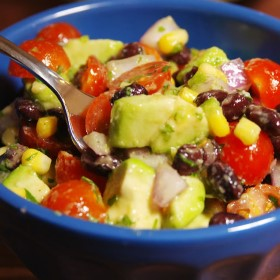



#  Guacamole Salad

Uncategorized

 **Prep** 0:10 **Cook** 0:10 **Makes** Serves: 4-6 **Difficulty** Easy
**Source**[Delish.com](http://www.delish.com/cooking/recipe-
ideas/recipes/a50674/guacamole-salad-recipe/)

###  Ingredients

  * **1/4** c. extra-virgin olive oil
  * Juice of 1 lime
  *  **1/4** tsp. cumin
  * kosher salt
  * Freshly ground black pepper
  *  **1** pint cherry tomatoes, halved
  *  **1/2** c. black beans, drained and rinsed
  *  **1/2** c. corn
  *  **1/2** medium red onion, finely chopped
  *  **1** jalapeno, minced
  *  **2** ripe avocados, cubed
  *  **2** tbsp. cilantro, chopped

###  Directions

In a small bowl, make dressing: Whisk together olive oil, lime juice, and
cumin. Season with salt and pepper. Set aside.

In a large bowl, combine remaining ingredients. Toss with dressing until well
combined.

