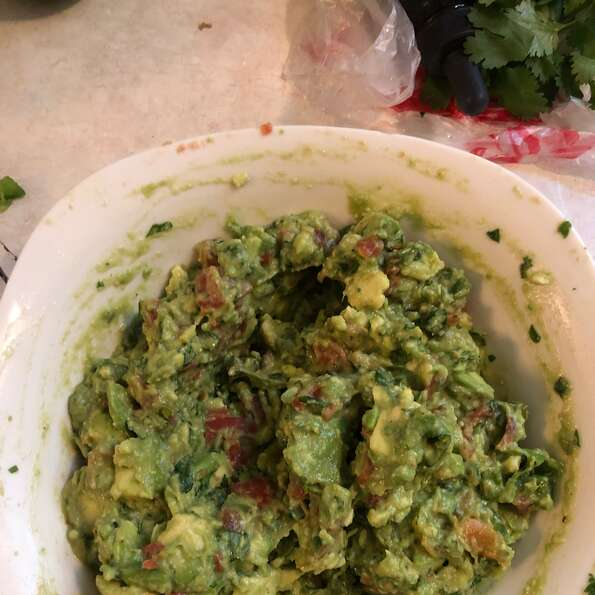

Prep: 10 mins  
Total: 10 mins  
Servings: 4  
Yield: 4 servings  

## INGREDIENTS
- 3 avocados - peeled, pitted, and mashed
- 1 lime, juiced
- 1 teaspoon salt
- ½ cup diced onion
- 3 tablespoons chopped fresh cilantro
- 2 roma (plum) tomatoes, diced
- 1 teaspoon minced garlic
- 1 pinch ground cayenne pepper (optional)
- 1 jalapeno pepper fine dice (optional)

## DIRECTIONS
- In a medium bowl, mash together the avocados, lime juice, and salt. Mix in onion, cilantro, tomatoes, and garlic. Stir in cayenne pepper. Refrigerate 1 hour for best flavor, or serve immediately.
