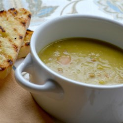

#  Ham and Split Pea Soup

**Prep** 20 m  
**Cook** 2 h 30 m  
**Makes** 4  
**Source:** Original

###  Ingredients

  *  **1** tablespoons butter
  *  **1** teaspoon olive oil
  *  **1/4** onion, diced
  *  **2** ribs celery, diced
  *  **1** most of a medium carrot, shredded
  *  **1 1/2** cloves garlic, sliced
  *  **1** ham bone
  *  **1** cup ham, diced
  *  **1 1/2** cups dried split peas, rinsed
  *  **2** cups chicken stock
  *  **3** cups water
  *  ground black pepper to taste

###  Directions

Place the butter and olive oil in a large soup pot over medium-low heat. Stir in onion,
celery, carrot and sliced garlic. Cook slowly until the onions are translucent but
not brown, 5 to 8 minutes.

Stir in peas. Add ham bone, diced ham, stock, and water.  Bring to boil.

Reduce heat to low and cover. Simmer, stirring every 30 minutes, until peas are mostly disintegrated, about 2 1/2 hours.

Take out ham bone.  Return any meat to pot.
