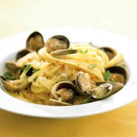



#  Linguine with White Clam Sauce

Uncategorized

  
**Prep** 20 mins  
**Cook** 35 mins  
**Makes** Servings: 4
**Source:** [Marthastewart.com](http://www.marthastewart.com/315602/linguine-
with-white-clam-sauce)

###  Ingredients

  * Coarse salt
  *   
**12** ounces linguine
  *   
**3** tablespoons olive oil
  *   
**1** medium onion, finely chopped
  *   
**4** garlic cloves, thinly sliced
  *   
**1/4** teaspoon red-pepper flakes
  *   
**3/4** cup dry white wine
  *   
**2** pounds small clams (50 to 55), such as Manila, rinsed and scrubbed
  *   
**2** tablespoons butter
  *   
**1/4** cup fresh parsley, coarsely chopped

###  Directions

In a large pot of salted boiling water, cook pasta 1 minute less than package
instructions for al dente. Reserve 1/2 cup pasta water; drain pasta. Set
aside.

While pasta cooks, heat oil over medium in a Dutch oven or 5-quart heavy pot
with a lid. Add onion, garlic, and red-pepper flakes. Cook, stirring
occasionally, until onion is soft, 5 to 7 minutes.

Add wine, and bring to a boil; cook, stirring occasionally, until reduced by
half, about 2 minutes.

Add clams; cover, and simmer, shaking pot occasionally, until clams open wide,
3 to 5 minutes. (Discard any that havent opened after 5 minutes.)

Add pasta to clam mixture in pot; continue to cook until pasta is al dente,
about 2 minutes. Remove from heat, and stir in butter and parsley. Add some
reserved pasta water to thin sauce if necessary; season with salt.

