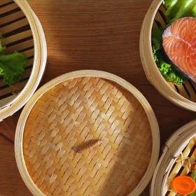



#  Low-Fat Gumbo

Uncategorized

  
**Prep** 15 mins  
**Cook** 30 mins  
**Makes** Servings 6-8
**Source:** [Food.com](http://www.food.com/recipe/low-fat-gumbo-327965)

###  Ingredients

  *  
**1** tablespoon extra spicy seasoning mix, I ended up adding lots more
  *   
**1** vidalia onion
  *   
**2** stalks celery, chopped
  *   
**1** bell pepper, chopped (any color)
  *   
**2** garlic cloves
  *   
**14** ounces chicken broth
  *   
**28** ounces stewed tomatoes
  *   
**1** lb shrimp, and or 1 lb chicken
  * pepper
  * salt
  * garlic powder
  *   
**1** cup okra (optional)
  *   
**1/2** cup corn (optional)
  *   
**1** teaspoon hot sauce (more or less)

###  Directions

Heat broth and mix hot spices, celery, bell pepper, and garlic till softened.

Add stewed tomatoes, okra, salt and pepper, and hot sauce - I added more extra
spicy mix.

Let simmer at least 20 minutes.

Add shrimp onions, corn, and a little garlic powder.

Can be served over rice.

###  Nutrition

Calories 138.2

Calories from Fat 14 10%

Total Fat 1.6 g 2%

Saturated Fat 0.4 g 1%

Cholesterol 147.2 mg 49%

Sodium 740 mg 30%

Total Carbohydrate 12.6 g 4%

Dietary Fiber 2.3 g 9%

Sugars 8 g 32%

Protein 19 g 38%

