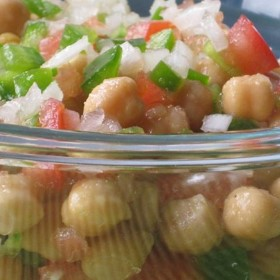

#  Mediterranean Chickpea Salad

lunch

  
**Prep** 15 m  
**Cook** 15 m  
**Makes** 4
**Source:** [Allrecipes.com](http://allrecipes.com/recipe/83653/mediterranean-
chickpea-salad-
ii/?internalSource=next%20recipe&referringId=238486&referringContentType=recipe&clickId=next%20recipe%20module&EventName=83653&AnalyticsEvent=right%20rail%20nav)

###  Ingredients

  *  
**1** (15 ounce) can garbanzo beans (chickpeas), drained and rinsed
  *   
**1** roma (plum) tomato, seeded and diced
  *   
**1** cucumber, diced
  *   
**1/2** medium green bell pepper, diced
  *   
**1** small onion, finely chopped
  *   
**1** small clove garlic, minced
  *   
**1** tablespoon chopped fresh parsley
  *   
**2** tablespoons olive oil
  *   
**1** lemon, juiced

###  Directions

In a bowl, toss together all ingredients Cover, and chill until serving.

###  Nutrition

Calories: 163 kcal

Total Carbohydrates: 22g

Cholesterol: 0 mg

Total Fat: 7.7 g

Protein: 4.3 g

Sodium: 213 mg

