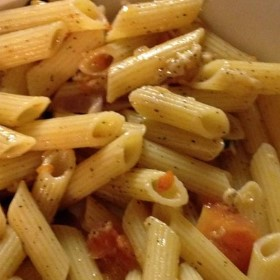



#  Pasta with Swiss Chard

Uncategorized

 **Prep** 10 m **Cook** 15 m **Makes** 2
**Source**[Allrecipes.com](http://allrecipes.com/recipe/218593/pasta-with-
swiss-chard/)

###  Ingredients

  * **1/3** pound whole-wheat spaghetti
  *  **2** tablespoons extra-virgin olive oil
  *  **1** clove garlic, minced
  *  **1** bunch Swiss chard, chopped
  *  **1** teaspoon capers
  * salt and pepper to taste
  *  **1** teaspoon lemon juice, or to taste (optional)
  *  **1/4** cup grated Parmesan cheese, or to taste

###  Directions

Fill a large pot with lightly salted water and bring to a rolling boil over
high heat. Once the water is boiling, stir in the spaghetti, and return to a
boil. Cook the pasta uncovered, stirring occasionally, until the pasta has
cooked through, but is still firm to the bite, about 8 minutes. Drain well in
a colander set in the sink.

Meanwhile, heat the olive oil in a large skillet over medium heat. Stir in the
garlic, and cook for 1 minute to soften. Add the Swiss chard. Cook and stir
until the stems of the chard are tender. You can use some of the hot pasta
water to help steam the chard in the covered pan.

Stir the hot spaghetti into the chard mixture along with the capers. Season to
taste with salt and black pepper, and drizzle with lemon juice if desired.
Sprinkle with Parmesan cheese to serve.

###  Nutrition

Calories: 453 kcal

Total Carbohydrates: 62.3g

Cholesterol: 9 mg

Total Fat: 17.7 g

Protein: 17.1 g

Sodium: 443 mg

