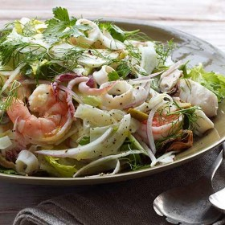



#  Seafood Salad

Uncategorized

 **Cook** 1 hr **Makes** 4 to 6 servings
**Source**[Foodnetwork.com](http://www.foodnetwork.com/recipes/food-network-
kitchen/seafood-salad-recipe2-2112678)

###  Ingredients

  * Kosher salt
  *  **3** lemons (1 halved, 2 juiced)
  *  **4** cloves garlic, smashed
  *  **1** small red onion, thinly sliced
  *  **1/2** pound large shrimp, peeled and deveined
  *  **1/2** pound sea scallops, halved or quartered if large
  *  **3/4** pound calamari, tubes thinly sliced, tentacles halved
  *  **1** pound mussels, scrubbed and debearded
  *  **2** inner stalks celery, thinly sliced
  *  **1** small bulb fennel, quartered, cored and thinly sliced, plus fronds for topping
  *  **1/2** cup sliced pitted green olives
  *  **1/2** cup fresh parsley
  *  **6** tablespoons extra-virgin olive oil
  * Freshly ground pepper

###  Directions

Bring a pot of salted water to a boil. Add the lemon halves and garlic, then
submerge a large heatproof strainer in the water. Soak the red onion in ice
water while you cook the seafood. Fill a large bowl with ice water; set aside.

Add the shrimp to the strainer in the boiling water and cook until pink, about
2 minutes; carefully remove the strainer and add the shrimp to the large bowl
of ice water. Bring the water back to a boil, return the strainer to the pot,
then add the scallops and simmer until cooked through, about 2 minutes; remove
the strainer and add the scallops to the ice water. Repeat with the calamari,
cooking until they just turn opaque, about 2 minutes. Repeat with the mussels,
covering the pot; cook until the shells open, about 5 minutes. Drain the
seafood from the ice water and remove the mussels from their shells; pat the
seafood dry.

Drain the red onion and pat dry. Combine the seafood, red onion, celery,
fennel, olives and parsley in a large bowl. Drizzle with the lemon juice and
olive oil and toss; season with salt and pepper. Let stand 30 minutes before
serving (or refrigerate up to 4 hours; bring to room temperature before
serving). Top with fennel fronds. Photograph by Con Poulos

