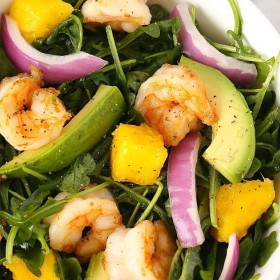



#  Shrimp, Mango, and Avocado Arugula Salad

Uncategorized

 **Cook** 0:06 **Makes** Serves: 4 **Difficulty** Easy
**Source**[Delish.com](http://www.delish.com/cooking/recipe-
ideas/recipes/a42721/shrimp-mango-avocado-arugula-salad/)

###  Ingredients

  * **1** lb. medium shrimp, peeled and deveined
  *  **1** tbsp. vegetable oil
  *  **5** c. arugula
  *  **1** avocado, sliced
  *  **1** mango, diced
  *  **1/2** red onion, sliced
  *  **1/4** c. extra-virgin olive oil
  * Juice of 2 limes
  * Pinch of sugar
  * Pinch of cumin

###  Directions

Heat oil in a large skillet over medium-high heat. Cook shrimp until opaque, 4
to 6 minutes.

In a salad bowl, combine arugula, shrimp, avocado, mango, and onion.

Make dressing: In a jar, combine olive oil, lime juice, sugar, and cumin. Toss
with salad.

