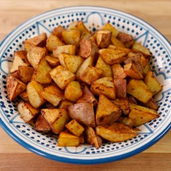

#  Smoked Paprika Roasted Potatoes

**Prep** 10 minutes  
**Cook** 25 minutes  
**Makes** Servings: 6  
**Source:** [Toriavey.com](http://toriavey.com/toris-kitchen/2013/02/smoked-paprika-roasted-potatoes/)

###  Ingredients

  *  **2** lbs. red potatoes
  *   **1 1/2** tbsp extra virgin olive oil
  *   **1 1/4** tsp smoked paprika
  *   **1** clove fresh garlic, minced very fine
  *   **3/4** tsp salt
  *   **1/4** tsp black pepper
  * Nonstick cooking oil spray (or a little more olive oil), for greasing the baking sheet
  * YOU WILL ALSO NEED
  * baking sheet, gallon-sized plastic zipper bag

###  Directions

Preheat oven to 450 degrees F. Scrub the potatoes clean, do not peel. Slice
into 1- to 1 1/2-inch wedges.

Place the wedges into a gallon-sized plastic zipper bag with olive oil. Close
the bag and toss the potatoes well. Work the potato wedges with your fingers
for a minute or two so that all the potato pieces are lightly coated with oil.

Open the bag and sprinkle in the spices and garlic. Close the bag again. Shake
the bag and massage the potato wedges again for a minute or two so that all
the pieces are evenly coated with seasoning.

Spray a baking sheet with nonstick cooking oil spray, or lightly brush with
more olive oil. Spread the potatoes out in an even layer onto the sheet,
making sure that the flat surfaces touch the sheet. This will help the
potatoes get crisp.

Place the baking sheet into the oven and let the potatoes roast for about 25
minutes, stirring once halfway through cooking, till the wedges are cooked
through. They should be crisp on the outside, fluffy and soft inside. Season
with additional salt to taste, if desired. Serve hot.

###  Notes

Note: these potatoes are kosher for Passover. If you look for a KFP hechsher
on your Passover ingredients, you may want to substitute regular paprika for
the smoked. I'm not sure if there is a Passover-certified smoked paprika on
the market yet, but a certified regular (sweet) paprika should not be hard to
find.

