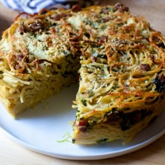



#  Spaghetti Carbonara Pie

Uncategorized

 **Prep** 30 min **Cook** 35 to 40 minutes **Makes** Yield: 8 servings
**Difficulty** Easy
**Source**[Foodnetwork.com](https://www.foodnetwork.com/recipes/spaghetti-
carbonara-pie-3569348)

###  Ingredients

  * **1** tablespoon butter
  *  **8** ounces pancetta
  *  **1 1/2** teaspoons coarse or kosher salt, plus more for the cooking water
  *  **1** bunch broccoli rabe
  *  **1** pound dried spaghetti
  *  **2** large eggs
  *  **2 to 3** large yolks
  *  **1 1/4** cups whole milk
  *  **1** teaspoon black pepper
  *  **8** ounces (about 2 cups) finely grated Parmesan and/or aged Pecorino-Romano

###  Directions

Heat oven to 425 degrees F. Butter a 9-inch springform pan and wrap the
outside tightly in aluminum foil. Place on a baking sheet.

Chop pancetta into 1/2-inch cubes and saute over medium heat until well
browned. Remove with slotted spoon and drain on paper towels.

Bring a large pot of well-salted water to a boil. Boil the broccoli rabe for 1
to 2 minutes in the salted water until it has some give. Fish it out with a
large slotted spoon and drain. Set aside.

Now add the spaghetti to your boiling water and cook until 2 minutes shy of
done, so very al dente. While the pasta cooks, use a towel to squeeze all
excess moisture from the broccoli rabe. Separate out 1 cup of broccoli rabe
and chop it finely. (Reserve the remainder for another use.)

Drain the pasta well and let cool slightly.

In large bowl, whisk eggs, yolks, milk, salt, pepper and all but 1/2 cup of
cheese together. Add the spaghetti, chopped broccoli rabe and pancetta and
toss to combine. Pour mixture into the prepared springform. Sprinkle last 1/2
cup cheese on top.

Bake 35 to 40 minutes, until bronzed and the center is set. The best way to
check is to tip your pan to the side and make sure no loose custard runs out.
If it does, bake it for 5 minutes more. If the top of your pie browns too
quickly before the center is set, cover it with foil for the remaining cooking
time.

Remove from the oven and let cool on a rack for 5 minutes before removing the
foil, cutting around springform to loosen and releasing the pie onto a serving
plate. Serve in wedges.

