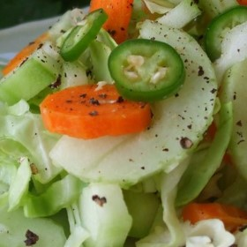



#  Spicy Bok Choy Slaw

Uncategorized

  
**Prep** 30 m  
**Cook** 1 h 30 m  
**Makes** 10
**Source:** [Allrecipes.com](http://allrecipes.com/recipe/215792/spicy-bok-choy-
slaw/?internalSource=staff%20pick&referringId=16678&referringContentType=recipe%20hub)

###  Ingredients

  *  
**1** head bok choy, finely shredded
  *   
**1** cucumber, seeded and finely shredded
  *   
**3** carrots, peeled and finely shredded
  *   
**5** hot cherry peppers, seeded and finely shredded
  *   
**5** jalapeno peppers, seeded and chopped
  *   
**3/4** cup apple cider vinegar
  *   
**1/4** cup coarse-grain brown mustard
  *   
**1/4** cup soy sauce
  *   
**2** tablespoons agave syrup
  *   
**1/8** teaspoon roasted ground ginger
  * freshly cracked black pepper to taste

###  Directions

Place the shredded bok choy, cucumber, carrots, and cherry peppers into a
large salad bowl. Place the jalapeno peppers into the work bowl of a food
processor, then pour in the apple cider vinegar, brown mustard, soy sauce, and
agave syrup. Pulse several times, then process for a few seconds to combine.
Pour the dressing over the vegetables and toss. Refrigerate from 1 hour to
overnight. Before serving, sprinkle with roasted ginger and black pepper; toss
again to serve.

###  Nutrition

Calories: 50 kcal

Total Carbohydrates: 9.6g

Cholesterol: 0 mg

Total Fat: 0.7 g

Protein: 2 g

Sodium: 485 mg

