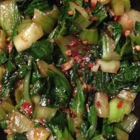



#  Spicy Bok Choy in Garlic Sauce

Uncategorized

  
**Prep** 15 m  
**Cook** 15 m  
**Makes** 4
**Source:** [Allrecipes.com](http://allrecipes.com/recipe/167331/spicy-bok-choy-
in-garlic-sauce/)

###  Ingredients

  *  
**1** pound bok choy
  *   
**1** tablespoon vegetable oil
  *   
**1** tablespoon sesame oil
  *   
**1/4** cup water
  *   
**1** teaspoon grated fresh ginger root
  *   
**2** cloves garlic, minced
  *   
**1** tablespoon oyster sauce
  *   
**1** tablespoon light soy sauce
  *   
**1** tablespoon brown sugar
  *   
**1/8** teaspoon crushed red pepper flakes (optional)

###  Directions

Trim off the ends of the bok choy and chop, keeping the white parts separate
from the green as they will need to cook longer. Rinse and spin or pat dry.
Set aside.

In a small bowl or cup, stir together the vegetable oil and sesame oil. In a
separate larger bowl, stir together the water, ginger, garlic, oyster sauce,
soy sauce, brown sugar and red pepper flakes. Set this aside.

Heat the oil in a large skillet or wok over medium-high heat. Add the bok choy
stems first; stir fry for a few minutes or until the pieces start to turn a
pale green. When stems are almost cooked, add the leaves; cook and stir until
leaves are wilted, 1 to 2 minutes. Remove from the heat and transfer the bok
choy to a serving dish. Pour the sauce into the skillet or wok, and set over
medium-high heat. Cook, stirring constantly, until sauce has thickened
slightly, about 3 minutes. Pour over the bok choy and toss lightly to coat.

###  Notes

Aluminum foil helps keep food moist, ensures it cooks evenly, keeps leftovers
fresh, and makes clean-up easy.

###  Nutrition

Calories: 93 kcal

Total Carbohydrates: 6.9g

Cholesterol: 0 mg

Total Fat: 7.1 g

Protein: 2 g

Sodium: 236 mg

