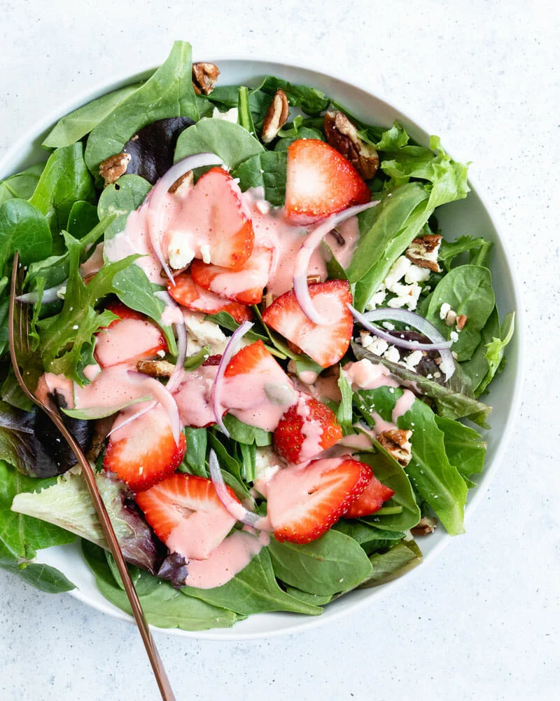

#  Strawberry Spinach Salad

**Prep** 15 min  
**Cook** 0 min  
**Makes** Serves 8 4
**Source:** [acouplecooks.com](https://www.acouplecooks.com/strawberry-spinach-salad/)

###  Ingredients

#### For the strawberry vinaigrette salad dressing (makes 1 ¼ cups total)

1 ½ cups sliced strawberries  
2 tablespoons maple syrup  
2 tablespoons apple cider vinegar  
¼ cup olive oil  
¼ teaspoon kosher salt  

#### For the strawberry spinach salad  

1 cup sliced strawberries  
1 handful thin sliced red onion  
5 cups baby spinach leaves  
3 cups mixed greens  
¼ cup chopped pecans  
¼ cup feta cheese crumbles (optional)  
½ cup Strawberry Vinaigrette Salad Dressing  

###  Directions

Make the strawberry salad dressing: In an immersion blender, small blender or standard blender, blend all ingredients until smooth. (An immersion blender and small blender are the quickest, but you can also use a standard blender: just blend for a few minutes until fully combined.)  

Prepare the salad ingredients: Slice off the tops of the strawberries, then slice them long-wise. Thinly slice the red onion (see the video for this method). If necessary, wash the spinach and mixed greens. Chop the pecans (if time, toast them to enhance the flavors).  

Serve: Place the greens on plates and top with all ingredients, then drizzle with the strawberry vinaigrette salad dressing (about 2 tablespoons per serving). Refrigerate the remaining dressing for up to 1 week.  

###  Nutrition

