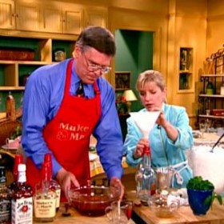



#  The Perfect Mint Julep

Uncategorized

 **Prep** 5 min **Cook** 24 hr 30 min **Makes** Yield: 10 to 12 servings
**Source**[Foodnetwork.com](http://www.foodnetwork.com/recipes/the-perfect-
mint-julep-recipe.html)

###  Ingredients

  * **4** cups bourbon
  *  **2** bunches fresh spearmint
  *  **1** cup distilled water
  *  **1** cup granulated sugar
  * Powdered sugar

###  Directions

To prepare mint extract, remove about 40 small mint leaves. Wash and place in
a small bowl. Cover with 3 ounces bourbon. Allow the leaves to soak for 15
minutes. Then gather the leaves in paper toweling. Thoroughly wring the mint
over the bowl of whisky. Dip the bundle again and repeat the process several
times.

To prepare simple syrup, mix 1 cup of granulated sugar and 1 cup of distilled
water in a small saucepan. Heat to dissolve sugar. Stir constantly so the
sugar does not burn. Set aside to cool.

To prepare mint julep mixture, pour 3 1/2 cups of bourbon into a large glass
bowl or glass pitcher. Add 1 cup of the simple syrup to the bourbon.

Now begin adding the mint extract 1 tablespoon at a time to the julep mixture.
Each batch of mint extract is different, so you must taste and smell after
each tablespoon is added. You are looking for a soft mint aroma and taste-
generally about 3 tablespoons. When you think it's right, pour the whole
mixture back into the empty liter bottle and refrigerate it for at least 24
hours to "marry" the flavors.

To serve the julep, fill each glass (preferably a silver mint julep cup) 1/2
full with shaved ice. Insert a spring of mint and then pack in more ice to
about 1-inch over the top of the cup. Then, insert a straw that has been cut
to 1-inch above the top of the cup so the nose is forced close to the mint
when sipping the julep.

When frost forms on the cup, pour the refrigerated julep mixture over the ice
and add a sprinkle of powdered sugar to the top of the ice. Serve immediately.

