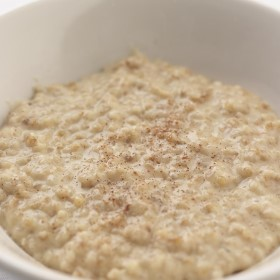



#  Traditional Scottish Recipe: Pinhead Oat Porridge

Uncategorized

 **Prep** 12 hours **Cook** 20 min **Makes** 4 **Difficulty** Easy
**Source**[Foodanddrink.scotsman.com](http://foodanddrink.scotsman.com/recipes/traditional-
scottish-recipe-pinhead-oat-porridge/)

###  Ingredients

  * **2.5** cups of pinhead oatmeal
  *  **1** cup of milk
  *  **1.5** tbls of butter
  *  **3** tbls of powered sugar
  *  **1** pinch of ground nutmeg
  *  **1** pinch of ground cinnamon
  *  **3** tbls of double cream

###  Directions

Pinhead oat porridge

1 The evening before serving, soak the oatmeal in a bowl of water for 12 hours

2 The next day, drain the oatmeal and put it in a saucepan with the milk and
butter. Bring to the boil then simmer gently, stirring occasionally, for 20-25
minutes or until the oats have softened

3 Remove from the heat and beat in the sugar, then the spices to taste. Stir
in the double cream and serve

This recipe first appeared on Great British Chefs. Take a look at their recipe
collections for some more great Scottish Recipes.

