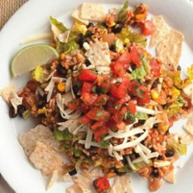



#  Vegetarian Taco Salad

Uncategorized

  
**Prep** 40 minutes  
**Cook** 40 minutes  
**Makes** 6 servings
**Source:** [Eatingwell.com](http://www.eatingwell.com/recipes/vegetarian_taco_salad.html)

###  Ingredients

  *  
**2** tablespoons extra-virgin olive oil
  *   
**1** large onion, chopped
  *   
**1 1/2** cups fresh corn kernels (see Tip) or frozen, thawed
  *   
**4** large tomatoes
  *   
**1 1/2** cups cooked long-grain brown rice (see Tip)
  *   
**1 15** -ounce can black, kidney or pinto beans, rinsed
  *   
**1** tablespoon chili powder
  *   
**1 1/2** teaspoons dried oregano, divided
  *   
**1/4** teaspoon salt
  *   
**1/2** cup chopped fresh cilantro
  *   
**1/3** cup prepared salsa
  *   
**2** cups shredded iceberg or romaine lettuce
  *   
**1** cup shredded pepper Jack cheese
  *   
**2 1/2** cups coarsely crumbled tortilla chips
  * Lime wedges for garnish

###  Directions

Heat oil in a large nonstick skillet over medium heat. Add onion and corn;
cook, stirring, until the onion begins to brown, about 5 minutes. Coarsely
chop 1 tomato. Add it to the pan along with rice, beans, chili powder, 1
teaspoon oregano and 1/4 teaspoon salt. Cook, stirring frequently, until the
tomato cooks down, about 5 minutes. Let cool slightly.

Coarsely chop the remaining 3 tomatoes. Combine with cilantro, salsa and the
remaining 1/2 teaspoon oregano in a medium bowl.

Toss lettuce in a large bowl with the bean mixture, half the fresh salsa and
2/3 cup cheese. Serve sprinkled with tortilla chips and the remaining cheese,
passing lime wedges and the remaining fresh salsa at the table.

TIPS & NOTES

Make Ahead Tip: Prepare through Step 1, cover and refrigerate for up to 3
days; reheat slightly before serving.

Kitchen Tips: To remove corn kernels from the cob, stand an ear of corn on its
stem end and slice the kernels off with a sharp knife.

To cook rice, bring 1 cup water and 1/2 cup long-grain brown rice to a boil in
a small saucepan. Reduce heat to low, cover, and simmer at the lowest bubble
until the water is absorbed and the rice is tender, about 40 minutes. Remove
from the heat and let stand, covered, for 10 minutes. Makes 1 1/2 cups.

###  Nutrition

Per serving: 395 calories; 17 g fat (5 g sat, 5 g mono); 20 mg cholesterol; 52
g carbohydrates; 0 g added sugars; 14 g protein; 9 g fiber; 459 mg sodium; 774
mg potassium.

Nutrition Bonus: Vitamin A & Vitamin C (38% daily value), Calcium & Folate
(23% dv), Potassium (22% dv), Magnesium (21% dv), Calcium (23% dv), Iron (15%
dv)

Carbohydrate Servings: 3

Exchanges: 3 1/2 starch, 1 vegetable, 1 lean meat, 2 fat

