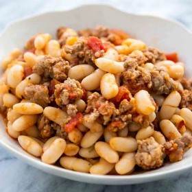



:max_bytes\(150000\):strip_icc\(\):format\(webp\)/__opt__aboutcom__coeus__resources__content_migration__simply_recipes__uploads__2007__09__white-
beans-sausage-horiz-a-1600-aecd4e3b589548cea049bf3f11c93540.jpg)

#  White Beans and Sausage

Uncategorized

 **Prep** 5 mins **Cook** 20 mins **Makes** Servings 4 to 8 servings
**Source**[Simplyrecipes.com](https://www.simplyrecipes.com/recipes/white_beans_and_sausage/)

###  Ingredients

  * **1** pound dried cannellini beans
  *  **2** tablespoons extra virgin olive oil
  *  **4-5** fresh sage leaves
  *  **2** cloves garlic, crushed
  *  **3** teaspoons kosher salt
  *  **4** black peppercorns
  * OR
  *  **4 15** -ounce cans cannellini beans
  *  **5** tablespoons extra olive oil
  *  **1 1/2** pounds sweet Italian sausage
  *  **4** cloves garlic, peeled and crushed
  *  **3-4** canned plum tomatoes, chopped
  * Pinch red pepper flakes
  *  **1** cup tomato purée
  * Salt (about 2 teaspoons) and freshly ground black pepper

###  Directions

Preparing dry beans if using:

Rinse and soak the beans

Rinse the dry beans under cold running water, removing any stones you may
find. Place the beans in a large pot and cover with at least a couple of
inches with cold water. Soak for at least 4 hours. (To do a quick soak, you
can pour boiling water over the beans and cover by a couple of inches, and
just soak for one hour instead of four.)

Cook beans with aromatics

Drain the beans. Return the beans to the pot and add 3 quarts of water to the
pot. Add 2 Tbsp olive oil, the sage leaves, 2 cloves crushed garlic, 3
teaspoons kosher salt, and the peppercorns. Cover, bring to a simmer on medium
heat, and simmer beans for one hour. Lower the heat so that the beans are
barely simmering. Cook for an additional 1-2 hours, or until beans are just
tender. Note that the fresher the beans the shorter the cooking time, the
older the beans the longer the cooking time. Remove from heat and let cool in
cooking liquid. Set aside 1/2 cup of the cooking liquid, drain the rest from
the beans.

Preparing the beans and sausage:

Cook the sausage

Heat one tablespoon of olive oil in a large, heavy-bottomed skillet over
medium heat. Remove sausages from their casings (if the sausage has come in
casings), and cook in the skillet until lightly browned, about 3-4 minutes.

Add the reserved bean cooking (or can) liquid, 4 Tbsp olive oil, garlic,
chopped tomatoes, and red pepper flakes,

stirring occasionally until slightly thickened, about 5 minutes.

Add the reserved beans and tomato purée

Season to taste with salt and pepper. Simmer a few minutes longer, stirring
gently, until sausage is cooked through and the sauce has thickened. Be
careful not to break up the beans.

